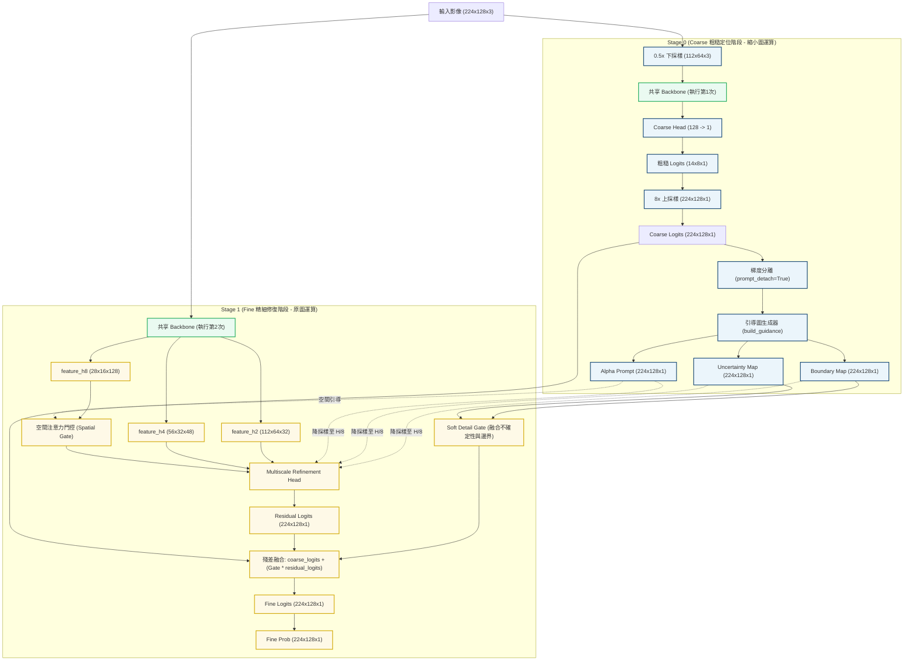

# Fast-SCNNSalient 2-Stage (Coarse-to-Fine) 架構說明文件

本文件詳細說明專案中修改後的 **Fast-SCNNSalient 2-Stage（雙階段遞進）** 顯著性目標分割模型的架構設計、數據流與維度變化。

---

## 🗺️ 1. 架構流程示意圖 (Mermaid)

---

## ⚙️ 2. 雙階段執行流程詳細說明

### 🔹 Stage 0: 粗糙定位與引導圖生成
1. **輸入影像下採樣**：
   將 $224 \times 128$ 影像下採樣為 $112 \times 64$，以極低的運算代價保留大尺度的語義輪廓。
2. **Backbone 前向傳播 (第一次)**：
   影像通過共享 Backbone 輸出 $14 \times 8 \times 128$ 的深層特徵。
3. **Coarse 預測**：
   由 `CoarseHead` 預測出粗略 Logits ($14 \times 8 \times 1$)，再以雙線性插值放大 8 倍至 **$224 \times 128 \times 1$**。
4. **梯度分離 (Gradient Detach)**：
   若設置 `prompt_detach=True`，第一階段的 Logits 會在此處切斷梯度，避免 Stage 1 的邊緣精細化梯度回傳干擾第一階段全域主體的學習。
5. **引導圖計算 (`build_guidance`)**：
   * **Alpha Prompt**：粗糙前景機率圖，即 $\sigma(\text{coarse\_logits})$。
   * **Uncertainty Map**：不確定性區域。計算公式為：
     $$\text{Uncertainty} = 4.0 \times \text{Alpha} \times (1.0 - \text{Alpha})$$
     在機率接近 `0.5`（邊緣或過渡帶）的地方值最大，主體內部或背景極為確定的地方值接近 `0.0`。
   * **Boundary Map**：邊界帶。透過局部最大值池化（MaxPool）與最小值池化（MinPool）相減計算得到。

---

### 🔹 Stage 1: 多尺度特徵融合與細節殘差混合
1. **Backbone 前向傳播 (第二次)**：
   將 $224 \times 128$ 原圖送入共享 Backbone，提取三個不同尺度的精細特徵：
   * **`feature_h2`** ($112 \times 64 \times 32$) - 淺層邊緣特徵
   * **`feature_h4`** ($56 \times 32 \times 48$) - 中層紋理特徵
   * **`feature_h8`** ($28 \times 16 \times 128$) - 深層語義特徵
2. **空間注意力門控 (Spatial Gate)**：
   利用第一階段生成的 Alpha Prompt 作為空間注意力圖，過濾掉 `feature_h8` 中無關背景區域的雜訊。
3. **精細解碼融合 (`MultiscaleRefinementHead`)**：
   * 門控後的深層特徵與三張降採樣後的引導圖打包，在 $\frac{1}{8}$ 尺度進行融合。
   * 逐步上採樣，並分別與高解析度的 `feature_h4` 和 `feature_h2` 進行 Skip Connection 拼接融合。
   * 在原圖解析度下通過最後一組標準 $3\times3$ 卷積，預測出 **`Residual Logits`** (邊緣修復殘差)。
4. **細節門控融合 (Soft Detail Gate)**：
   * 融合不確定性與邊界圖得到細節門控強度（`detail_gate = max(uncertainty, boundary)`），並加入 `uncertainty_floor` 防止門控徹底關閉。
   * **融合公式**：
     $$\text{fine\_logits} = \text{coarse\_logits} + \text{detail\_gate} \times \text{residual\_logits}$$
     * **主體內部**：$\text{detail\_gate} \approx 0.0$，輸出幾乎完全等於 $\text{coarse\_logits}$（維持內部完整、白底均勻）。
     * **物體邊緣**：$\text{detail\_gate} \approx 1.0$，輸出會融合 $\text{residual\_logits}$ 以修復半透明羽毛或鋸齒邊緣。
5. **輸出**：經過 Sigmoid 得到最終的精細分割圖 **`Fine Prob`**。

---

## 📊 3. 輸入尺寸為 224x128 時的特徵維度變化

| 模組 / 網絡層 | 輸入維度 (C, H, W) | 輸出維度 (C, H, W) | 卷積核與步長 | 運算量說明 |
| :--- | :--- | :--- | :--- | :--- |
| **Stage 0 下採樣** | $(3, 128, 224)$ | $(3, 64, 112)$ | 雙線性插值 | 無 MACs |
| **Stage 0 Backbone** | $(3, 64, 112)$ | $(128, 8, 14)$ | 共享主幹 | 約 19.30 M MACs |
| **Coarse Head** | $(128, 8, 14)$ | $(1, 8, 14)$ | DSConv, 1x1 Conv | 約 1.55 M MACs |
| **Coarse 上採樣** | $(1, 8, 14)$ | $(1, 128, 224)$ | 雙線性插值 | 無 MACs |
| **Stage 1 Backbone** | $(3, 128, 224)$ | 輸出一組多尺度特徵 | 共享主幹 | 約 77.21 M MACs |
| **- feature_h2** | - | $(32, 64, 112)$ | Stride=2 輸出 | (包含於上方) |
| **- feature_h4** | - | $(48, 32, 56)$ | Stride=4 輸出 | (包含於上方) |
| **- feature_h8** | - | $(128, 28, 16)$ | Stride=8 輸出 | (包含於上方) |
| **Refinement Head** | 融合多尺度特徵與引導圖 | $(1, 128, 224)$ | 多尺度漸進上採樣 | 約 262.59 M MACs |
| **- out_conv (最後一層)** | $(32, 128, 224)$ | $(24, 128, 224)$ | $3\times3$ Conv, Stride=1 | **約 148.64 M MACs** (核心運算量) |
| **- pred_conv** | $(24, 128, 224)$ | $(1, 128, 224)$ | $1\times1$ Conv, Stride=1 | 約 0.69 M MACs |

---

## ⚖️ 4. 與 2-Head (1-Stage) 架構裝置對比

| 評估維度 | 2-Head (1-Stage) | 2-Stage (本架構) |
| :--- | :--- | :--- |
| **Backbone 執行次數** | **1 次** (只跑原圖 $224 \times 128$) | **2 次** (跑 $112 \times 64$ 小圖與 $224 \times 128$ 大圖) |
| **粗糙與精細頭關係** | **並行（Parallel）**：兩頭同時處理 Backbone 提取的特徵。 | **串聯（Sequential）**：精細頭依賴粗糙預測輸出的空間引導圖。 |
| **總運算量 (224x128)**| **345.48 M MACs (0.3455 GMacs)** | **361.36 M MACs (0.3614 GMacs)** |
| **邊緣修復穩定度** | 普通。粗糙預測未收斂時會大幅干擾精細頭。 | 極佳。小圖先收斂大體，梯度分離使訓練極為穩定。 |
